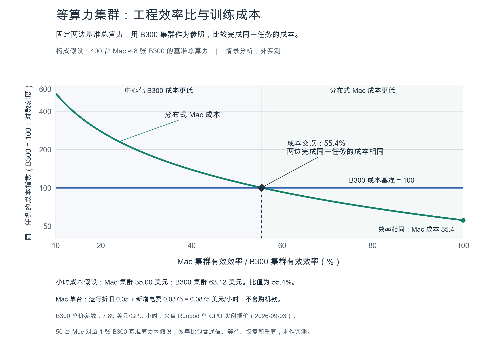

# TAMOMO 长期价值与成本讨论总结

更新：2026-09-03。本文汇总本轮讨论确认的价值主张、证据、成本口径与后续验证方向。项目仍处于 RFC 阶段，已有研究文档和成本绘图脚本，尚无训练实现或自有训练结果。

## 核心主张

**让个人设备成为开放智能的共同生产者。利用个人设备的自然升级降低等算力运行成本，通过软件减少协作损失，让越来越多的训练任务进入成本优势区间。**

这一主张需要逐步验证。近期先让单机和两台 Mac 完成可复现的小模型从零训练，积累公开可用的代码、配置、曲线、checkpoint 和失败记录。研究与教学价值可以先成立，商业成本优势和 AGI 能力需要各自的证据。

| 面向谁 | 长期价值 | 成立条件 |
| --- | --- | --- |
| 投资人 | 将分散、可中断的闲置设备组织成有用的训练资源，积累协作软件、测量与交付能力 | 同质量任务能够可靠完成，成本可控，外部用户有持续需求 |
| 贡献者 | 学习、复现、使用和继续改进开放训练成果，并获得明确的贡献记录 | 参与者知道任务与成本，保留日常使用和退出的控制权，成果许可清晰 |
| 研究者与小团队 | 以已有设备发起更多实验，理解和检验模型如何产生 | 实验可复现，数据来源明确，结果和限制公开 |

目前没有收入、客户或成本优势的验证；设备参与不自动形成模型所有权、收益权或治理权。当前系统不依赖支付、代币、奖励或算力市场。

## 个人设备能否完成 AGI 训练

单台个人设备研究小模型训练已有工具基础；个人设备网络完成有用模型训练是可检验的方向。**现有证据不能确认单台普通设备或普通 Mac 网络能够在可接受的时间和成本内从零训练 AGI。**

分布式训练系统解决设备如何协作的问题。AGI 还取决于模型、算法、数据、完整训练过程和能力评价，参数量、设备数或训练完成都不足以单独证明它。

本轮复用的相关工作包括 [MLX Distributed](https://github.com/ml-explore/mlx/blob/main/docs/src/usage/distributed.rst)、[DiLoCo](https://arxiv.org/abs/2311.08105)、[OpenDiLoCo](https://arxiv.org/abs/2407.07852)、[INTELLECT-1](https://www.primeintellect.ai/blog/intellect-1-release) 和 [Train at Home / IOTA 官方指南](https://docs.macrocosmos.ai/product-and-services/tah/tah-user-guide)。专业 GPU 跨地域预训练和 Mac 参与客户端提供了相邻证据，不能直接作为 TAMOMO 的成果或全部训练来自个人设备的证明。

数量级估算也说明了边界：示例中的 10B 参数、1T tokens 稠密预训练约需 6 × 10²² FLOPs；特定优化器状态配置约需 160 GB 固定训练状态，尚未计入激活和临时空间。它是示例任务，不是 AGI 门槛；假设吞吐不能写成 Mac 实测。完整推导见[长期价值与可行性](./long-term-value.md)。

如果这一方向成功，价值可能逐级扩大：从让学生和小团队更容易训练有用的小模型，到让更多群体发起基础模型训练，再到有条件地探索通用智能。开放的方法、可获得的成果和可解释的协作决策，决定参与者能否真正受益。

## Apple 与 NVIDIA 的硬件观察

以下归纳本轮截至 2026-09-03 核查的资料；完整配置、报价范围与来源保留在专项文档。

| 对象 | 本轮关注的数据 | 对成本判断的意义 |
| --- | --- | --- |
| Apple 新工作台 | M6、M5 Ultra 于 2026-08-25 发布；M5 Ultra Mac Studio 为 96–512 GB 统一内存、1.2 TB/s 带宽 | 大内存可能让训练状态留在本地；最新配置尚无本项目从零训练实测 |
| NVIDIA 最新架构 | Vera Rubin 的规格已公开；本轮未核实到同口径公开小时价 | 用作技术对照，不能据无报价规格得出成本结论 |
| 已有公开租价的 GPU | Runpod 单 GPU 实例：RTX PRO 6000 $2.09/h、B200 $6.79/h、B300 $7.89/h | 提供成本情景参数，具体实例不等于高速互联多节点集群报价 |

硬件与价格来源：[Apple 发布稿](https://www.apple.com/newsroom/2026/08/apple-introduces-m6-and-m5-ultra-for-a-big-leap-in-performance-and-ai-compute/)、[Mac Studio 规格](https://www.apple.com/mac-studio/specs/)、[Rubin 规格](https://www.nvidia.com/en-us/data-center/vera-rubin-nvl72/)、[Runpod 定价](https://www.runpod.io/pricing)。

本轮同时记录了 Mac Studio M5 Ultra 美国整机起价 5,499 美元、中国大陆起价 46,999 元，均对应 96 GB 入门配置；不能与最高 512 GB 能力拼接。[美国发布稿](https://www.apple.com/newsroom/2026/08/apple-introduces-new-mac-studio-with-m5-max-and-m5-ultra/) · [中国大陆发布稿](https://www.apple.com.cn/newsroom/2026/08/apple-introduces-mac-studio-with-m5-max-and-m5-ultra/)。购置价格用于独立的采购决策，**不进入已有闲置 Mac 的主成本模型**。

更大内存、更快本地互联和更高持续吞吐都有可能减少成本，最终需测量完成相同质量任务的时间与新增电量。不同精度峰值、推理 TOPS、内存带宽和厂商 AI 宣传倍数不能直接互换成训练速度。

## 确认的闲置设备成本口径

前提是 Mac 已经拥有，训练使用原本闲置、没有挤占日常用途的时段：

    任务成本 = 所有参与设备的额外运行折旧之和 + 新增电费之和
    新增电费 =（训练整机电量 − 同等时段原闲置基线电量）× 电价

运行折旧只计训练额外造成的损耗、寿命或剩余价值减少。历史购机款、自然贬值和已有网络的固定支出不再分摊；没有依据时，折旧保持为敏感性假设。设备原本会休眠或关机，就使用相应电量基线。

通信等待、失败、恢复和重算通过实际运行时间与电量计入。离线且没有新增运行成本的时间影响日历工期，不重复计费。多机任务逐台累加，不能以整个网络的吞吐搭配一台设备的成本。

当前示例假设单台 Mac 每小时额外折旧 0.05 美元、新增功率 250 W、电价 0.15 美元/kWh，合计 **0.0875 美元/小时**；100 小时为 8.75 美元。均不是实测成本。若以后专门购机，应另行评估新增采购投入。

与云端比较时，另一边采用实际租金，云电费不重复加计。这回答设备拥有者如何选择资源；若双方都拥有闲置硬件，应对双方使用额外折旧与新增电费。

## 等算力集群的相交成本曲线

**固定工程损耗前的基准总算力、任务和质量目标，横轴统一为 Mac 集群有效效率占 B300 集群有效效率的比例。**B300 集群保持固定；两边各自的绝对效率不作为两条独立横轴。

设效率比为 R，等算力 Mac 集群每小时成本为 A，B300 集群每小时租金为 B：

    Mac 任务成本 / B300 任务成本 = (A / B) / R
    等成本交点 R* = A / B

在当前**假设**中，400 台 Mac 与 8 张 B300 基准总算力相同。每小时成本分别为 35.00 美元和 63.12 美元，因此交点约为 **55.4%**。Mac 集群有效效率高于该交点时，同质量任务成本更低；效率相同时，Mac 的任务成本约为 B300 的 55.4%。

**55.4% 没有包含 Mac 购买成本，也不是已测得的工程效率、固定技术门槛或 AGI 门槛。**它依赖设备数量换算、额外折旧、功耗与租价。完整公式、逐点数据和绘图脚本见[工程效率比与训练成本](./engineering-efficiency-cost.md)。

## 时间尺度与更好的个人设备

长期需要区分两条进展：等算力的每小时成本比下降，使交点向左移动；协作损失减少，使实际效率比向右移动。两者都有机会让更多任务进入成本优势区间。

固定 B300 能力和价格，沿用当前运行成本模型：

| 个人设备变化，均为假设 | 等成本效率比 |
| --- | ---: |
| 当前示例 | 55.4% |
| 单机参考训练能力翻倍，每小时运行成本不变 | 27.7% |
| 单机参考训练能力翻倍，每小时运行成本增加 50% | 41.6% |

更强工作台可能通过更少节点、更大本地内存和更少公网同步来提高实际效率，是否实现需用实验确认。未来 NVIDIA 也会进步，评估每一代个人设备时都应同步更新集中式方案。上述三个情景的推导与复算见[硬件升级与交点变化](./engineering-efficiency-cost.md#硬件升级与交点变化)。

把视野拉长到数年，为硬件和算法迭代留下了空间；单纯延长一次训练的工期不会自动提高效率。更宽松的期限可以允许任务使用更多闲置时段，提高可完成性。55.4% 应随证据更新，无须成为永久追求的指标。

## 下一步用实验替换假设

| 顺序 | 最小工作 | 需要保留的证据 |
| --- | --- | --- |
| 1 | 现有 Mac 单机从随机初始化训练小模型 | 配置、数据版本、loss 曲线、内存、达标时间、训练与原闲置电量 |
| 2 | 两台 Mac 复现相同任务 | 同质量成本、同步量、等待、掉线恢复和重算；保留失败运行 |
| 3 | 在声明的条件下加入真实网络和不同设备 | 有效吞吐、累计设备运行成本、日历工期、哪些节点加入后确有净收益 |
| 4 | 具备资源时与集中式方案比较 | 匹配的质量目标、实际账单与训练速度，替换等算力换算和成本交点 |
| 5 | 外部复现后逐级扩大规模与能力 | 独立复现、重复使用需求、规模变化后的成本与能力评估 |

优先复用已有框架，先实现最小基线；不因新品规格或成本算例直接扩大模型、购买设备或创建云资源。若协作持续抵消新增算力，先调整算法、网络或任务范围。

## 文档入口

- [长期价值与 AGI 可行性](./long-term-value.md)：价值对象、相关工作、数量级约束和阶段性验证路线。
- [Apple 芯片与个人工作台](./apple-workstation-cost-2026-09-03.md)：配置、价格、交付时间及工作台降本条件。
- [Apple 与 NVIDIA 训练成本比较](./apple-nvidia-training-cost-2026-09-03.md)：报价范围、单机情景和成本边界。
- [等算力工程效率成本曲线](./engineering-efficiency-cost.md)：最终横轴定义、相交曲线、未来情景及复现入口。

## 本次归档验证

已执行各专项文档中的算术复核，核对 902 个曲线采样点与交点恒等式，并检查本地链接、章节锚点、SVG 语法和文件格式。绘图脚本从正式参数生成 PNG、SVG 与 CSV；图中折旧和电费标注随参数计算，输出使用固定资料日期。55.4%、27.7%、41.6% 三个情景均已复算。

这些验证覆盖文档和成本计算，实际训练、收敛与跨设备性能仍待实验。
